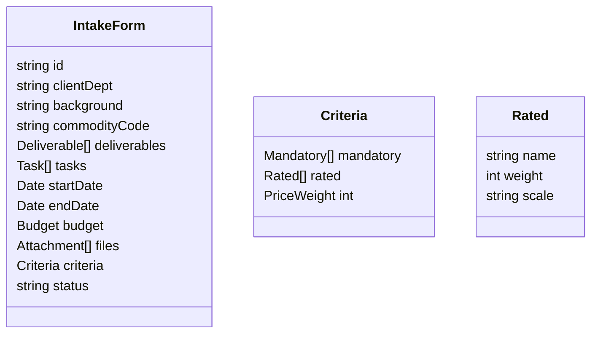

# RFx Dev Assist – Functional Requirements Blueprint  

Public‐sector institutions across Canada face significant delays and compliance risks when producing Request-for-X (RFx) solicitation packages.  The following blueprint translates your meeting notes, hand-drawn outline, and supplementary research into a concise, implementation-ready functional-requirements document.  Each section clarifies the intended behaviour, embeds governing policy references, and supplies exemplary documentation links that your development team can leverage during build-out.

## Overview  

RFx Dev Assist is a collaborative web application that guides public-sector buyers from initial intake to final posting, automating compliance checks against trade agreements and provincial procurement directives.  The system separates tasks into five user-facing stages while maintaining an auditable trail for procurement reviewers.

## Architecture at a Glance  

| Layer | Responsibilities | Users | Key Regulations |
|---|---|---|---|
|Intake & Conversation Engine|Chat-based scope elicitation, auto-generated intake form, AI “nudges” to surface missing info.|End user (client department)|BPS Procurement Directive 7.2.4 – Information Gathering[1]|
|Policy-Rules Micro-service|Real-time validation of scope and criteria against restrictive-requirement rules.|AI engine + Procurement|Procurement Ombudsman Regulations §12 (fairness, openness)[2]|
|Document Assembly Service|Fills organization’s RFx template, tracks changes, bundles attachments.|Procurement|PSPC sample RFP shell[3]| 
|Approval Workflow & E-Signature|Segmented approvals (client, procurement, compliance), checklist gating.|End user, Procurement, Senior approver|BPS Mandatory Requirements #23, #24, #25 (records, conflict, dispute)[1]|
|Publishing Gateway|Generates MERX/CanadaBuys posting notice; enforces minimum posting days.|Procurement|Federal Trade Agreement Threshold Notice 2023-6[4]|

## STEP 1 – User Input Request Form  

### 1.1 Scope Development Chat  
**Goal:** Replace ad-hoc emails with a guided chat that outputs a normalized JSON intake object.  
**Key Fields:**  
- Background / Problem Statement  
- Commodity or Service Type (NAICS/UNSPSC auto-suggest)  
- Deliverables & Tasks (checkbox suggestions)  
- Desired Start / End Dates  
- Attachments (drag-and-drop)

**AI Prompts:**  
- “List the top 5 deliverables typical for a data-science services engagement.”  
- “Select any tasks that apply; un-selected tasks remain editable.”  

**Validation Rules:**  
- Flag phrases matching Ombudsman’s restrictive examples (e.g., “40 years’ experience”) with inline warning popup[5].  
- If timeline $121,200, display policy alert citing BPS Directive 7.2.7[1].

### 1.2 Selection Requirements Wizard  
- Must-Have vs. Nice-to-Have toggle generates preliminary Mandatory and Rated criteria.  
- Dropdown for Minimum Years of Experience: cap at 20 to avoid unreasonable limits.  
- AI surfaces default scoring scales (e.g., 0-4) with editable weights; ensures price weight ≥40% unless overridden by procurement lead.

### 1.3 Budget Tolerance Scale  
- Slider: “Budget Sensitive” ←→ “Budget Flexible.”  
- If “Unknown,” AI estimates cost using hourly-rate dataset (future integration).

## STEP 2 – AI-Generated Scope & Evaluation Package  

| Artifact | Auto-Generated Content | Compliance Hook |
|---|---|---|
|Scope of Work (SoW)|Intro, deliverables, tasks, special requirements, timeline.|Checks open-competition rules vs. NAFTA/CETA thresholds[4][6].|
|Mandatory Criteria Table|Plain-language statement + Pass/Fail legend.|Verifies criteria not “overly restrictive” per Ombudsman advisories[7].|
|Rated Criteria Matrix|Weighted technical vs. price grid; formula auto-fills evaluation matrix template[8][9].|Ensures total weight=100 and price weight ≥ mandated minimums.|
|Pricing Form|Line‐item table or hourly-rate sheet.|Detects hidden brand names; prompts generic description.|
|RFx Timelines Block|Issue date + minimum 30-day posting if value ≥$121,200[10].|Includes trade-agreement posting periods (GPA 35 days if hard-copy)[11].|
|Estimated Cost Sheet|AI hours × benchmark rates; color-coded accuracy band.|Flags if estimate exceeds client budget. |

## STEP 3 – Procurement Review Dashboard  

### 3.1 Checklist Auto-Population  
- **Segregation of Duties:** 4-eyes rule enforced; system logs editor IDs.  
- **Competitive Thresholds:** System confirms open-tender mandated when goods/services >$121,200[10].  
- **Bid-Dispute Language:** Inserts standard clause from BPS Directive 7.2.25 with link to OECM sample wording[12].  

### 3.2 Policy Violation Flags  
| Flag Type | Trigger Example | Reference |
|---|---|---|
|Restrictive Scope|“Coffee cups must be red with a T.”|Ombudsman fairness criteria[13]|
|Insufficient Timeline|Posting period $8,800,000 (CETA threshold)[4].  
- Generates Posting Notice snippet max 200 words, populates MERX XML fields (title, close date, contact).

## STEP 5 – Approvals Workflow  

| Stage | Approver View | Must-Sign Sections | SLA |
|---|---|---|---|
|End User Review|Slim view: Statement of Work, Evaluation Matrix, Timeline.|“Approve” or “Request Change” buttons.|3 wd|
|Procurement Lead Review|Full redline doc + checklist status.|Entire RFx package.|5 wd|
|Compliance / Senior Mgmt|PDF summary of flags + resolutions.|Checklist + final document hash.|5 wd|

System sends auto-reminders 24 h before SLA breach; escalates to manager after +48 h.

## Cross-Cutting Functional Requirements  

### A. Audit & Record Retention  
- Store all generated artifacts and chat logs in immutable blob storage for 7 years per BPS Directive 7.2.23[1].  
- Provide “Download Audit Bundle” ZIP for litigation hold.

### B. Trade-Agreement Engine  
- Maintain JSON config of current thresholds (auto-update every 2 years via TBS notice feed)[6].  
- Surface applicable agreement names in UI badge (e.g., CFTA, CETA).

### C. Vendor-Neutral Language Library  
- Central list of banned adjectives/brand names (e.g., “Cisco-only”) with suggested neutral replacements (“enterprise-grade network switch”).  
- Editable by policy team; versioned.

### D. Accessibility & Bilingual Compliance  
- All UI WCAG 2.2-AA.  
- Output RFx templates bilingual where organization’s policy applies; integrate translation API.

### E. Deployment Topology  
| Option | Description | Data Residency | Notes |
|---|---|---|---|
|Private Cloud (Azure Gov CAN)|Single-tenant SaaS; encrypted storage.|Canadian region.|Meets PHIPA/FIPPA data-location rules.|
|On-Prem Container Package|Kubernetes helm chart; customer hardware.|Customer site.|Higher capital cost; suitable for defense agencies.|

Both deployments require outbound HTTPS to LLM inference endpoint; if air-gapped, ship distilled on-prem LLM (≤7 B parameters) trained on non-sensitive policy texts.

## Sample Supporting Documents Library  

| Doc Type | Use Case | Source |
|---|---|---|
|“Unnecessarily Restrictive Requirements – Canadian Cases” article|Train LLM on restrictive-criteria patterns.|Procurement School blog[5]|
|BPS Directive Toolkit (Procurement Scorecard, Evaluation Handbook)|Embed evaluation-matrix templates.|Supply Ontario toolkit PDF[15]|
|Procurement Ombudsman Regulations (SOR /2008-143)|Automated compliance‐flag rules engine.|Justice Laws website[2]|
|Federal RFP Sample Template (Informatics ProServices)|Baseline DOCX for template engine testing.|PWGSC sample[3]|
|Evaluation Matrix (Scoring Spreadsheet XLS)|Starter file for auto-populated matrix module.|Procurement Journey template[16]|  

All documents should be stored in an internal “Reference” S3 bucket and linked contextually in the UI help panels.

## Non-Functional Requirements  

- **Performance:** Generate full RFx document (<150 pages) in ≤15 s at P95.  
- **Scalability:** Support 500 concurrent sessions; autoscale containers.  
- **Security:** ISO 27001/ SOC 2; role-based access (Viewer, Editor, Approver, Admin).  
- **Logging:** Centralized ELK; redact PII in test environment logs.  
- **Disaster Recovery:** RPO = 1 hour; RTO = 4 hours.  

## Roadmap Considerations  

1. **Phase 1 (MVP)** – Core chat intake, SoW generator, manual template export.  
2. **Phase 2** – Live policy engine flags, integrated evaluation matrix, track-change template population.  
3. **Phase 3** – End-to-end approval workflow, auto-publishing to MERX API, BOBI/US Restriction module.  
4. **Phase 4** – Predictive budget estimator, multilingual AI summaries, analytics dashboard (cycle-time KPIs).

## Appendix – Data Model (Simplified)  

## Implementation Check-List  

- [ ] Load BPS Directive JSON config into policy engine.  
- [ ] Ingest Ombudsman restrictive requirement patterns into regex library.  
- [ ] Map organization’s RFx merge tags to standard schema.  
- [ ] Create CI pipeline for DOCX template validation.  
- [ ] Develop React component for slider-based budget tolerance.  
- [ ] Configure SSO via Azure AD; enforce MFA.  

## Concluding Notes  

The specifications above re-express your original outline in implementation language while embedding policy safeguards and modular touch-points for future expansion.  Adhering to these functional requirements will help ensure that RFx Dev Assist not only accelerates drafting but also positions every solicitation for audit-proof compliance across Canadian public-sector jurisdictions.

[1] https://www.ontario.ca/files/2024-02/tbs-bps-procurement-directive-en-2024-02-08.pdf
[2] https://laws-lois.justice.gc.ca/eng/regulations/SOR-2008-143/page-1.html
[3] https://www.tpsgc-pwgsc.gc.ca/app-acq/sp-ps/clients/propositions-rfp-eng.html
[4] https://www.canada.ca/en/treasury-board-secretariat/services/policy-notice/contracting-policy-notice-2023-6-trade-agreements.html
[5] https://procurementoffice.com/unnecessarily-restrictive-requirements-part-1-canadian-cases/
[6] https://publications.gc.ca/collections/collection_2024/sct-tbs/BT12-10-2023-6-eng.pdf
[7] https://opo-boa.gc.ca/praapp-prorev/2023/epa-ppr-05-2023-eng.html
[8] https://templatetom.com/procurement-templates/evaluation-matrix/
[9] https://www.procurementjourney.scot/route-2/evaluation/evaluation-tools
[10] https://files.ontario.ca/tbs-bps-procurement-directive-en-2023-08-23.pdf
[11] http://www.newwestpartnershiptrade.ca/pdf/procurement_guidelines.pdf
[12] https://oecm.ca/faqs/how-does-oecm-align-to-the-bid-dispute-resolution-stages-per-the-ontario-governments-bid-dispute-resolution-guide-for-public-sector-organizations/
[13] https://opo-boa.gc.ca/autresrapports-otherreports/enonprinc-positpaper-eng.html?pedisable=true
[14] https://www.supplyontario.ca/wp-content/uploads/US-Procurement-Restriction-Policy-Guide-March-4-2025-EN-1.pdf
[15] https://www.doingbusiness.mgs.gov.on.ca/mbs/psb/psb.nsf/attachments/bpsproc-toolkit-pdf-eng/$file/bpsproctoolkit-eng.pdf
[16] https://www.procurementjourney.scot/sites/default/files/Evaluation%20Matrix.xlsx
[17] https://ppl-ai-file-upload.s3.amazonaws.com/web/direct-files/attachments/18663271/ba6fee62-3aab-4059-b4e8-f2cfe813e25b/RFx_Dev_Assist_Meeting_Notes.md
[18] https://ppl-ai-file-upload.s3.amazonaws.com/web/direct-files/attachments/18663271/09aa96e4-3350-4765-86cf-01addb79db5e/RFx_Dev_Assist_Template.md
[19] https://opo-boa.gc.ca/autresrapports-otherreports/analysemerx-analysismerx-eng.html?pedisable=true
[20] https://www.ices.on.ca/accountability-and-reporting/sourcing-and-procurement/
[21] https://publications.gc.ca/collections/collection_2021/sac-isc/R2-197-2002-eng.pdf
[22] https://beta.novascotia.ca/sites/default/files/documents/1-1072/trade-agreements-thresholds-and-posting-timelines-en.pdf
[23] https://opo-boa.gc.ca/autresrapports-otherreports/rmbprms-rgvsc-eng.html?pedisable=true
[24] https://www.merx.com/public/faq
[25] https://www.procurement.utoronto.ca/about-procurement/trade-agreements
[26] https://opo-boa.gc.ca/rapports-reports/2021-2022/index-eng.html
[27] https://www.infrastructureontario.ca/48e26c/contentassets/4b13cce97461496482259638d7eb1cd2/io-procurement-policy-2023.pdf
[28] https://www.blg.com/en/insights/2023/12/amendments-to-the-bps-procurement-directive-effective-january-1-2024
[29] https://www.raqs.merx.com/public/bulletin/bulletin.jsf
[30] https://www.fasken.com/-/media/4024be7e27a542f2abccb23a9194cf6c.pdf
[31] https://www.supplyontario.ca/wp-content/uploads/US-Procurement-Restriction-Policy-FAQs-March-4-2025-EN-1.pdf
[32] https://www.uoguelph.ca/finance/bps-procurement-directive-requirements-overview
[33] https://icss.ca/wp-content/uploads/2022/05/Ontario-Broader-Public-Sector-Procurment-Directive-Policy.pdf
[34] https://www.supplyontario.ca/building-ontario-businesses-initiative/
[35] https://carleton.ca/procurement/open-competitive-procurement/
[36] https://assets.metrolinx.com/image/upload/v1663240044/Documents/Metrolinx/PT-2017-IT-301.pdf
[37] https://www.trentu.ca/purchasing/resources-staff/building-ontario-businesses-initiative-act
[38] https://www.oacas.org/wp-content/uploads/2018/07/OACAS-Procurement-Policy.pdf
[39] https://ontarioonecall.ca/wp-content/uploads/Procurement-Policy.pdf
[40] https://www.queensu.ca/procurement/strategic-sourcing/building-ontario-businesses-initiative-act-bobia
[41] https://procurementoffice.com/unnecessarily-restrictive-requirements-part-2-global-cases/
[42] https://www.opsba.org/wp-content/uploads/2021/02/BPSdirectiveComparisonTable.pdf
[43] https://opo-boa.gc.ca/documents/autresrapports-otherreports/merx-eng.pdf
[44] https://www.torontomu.ca/financial-services/purchasing-payment/purchasing-governance/building-ontario-businesses-initiative-act/
[45] https://torontoccas-fr.org/wp-content/uploads/2022/09/procurement_policy_01_05_10.pdf
[46] https://www2.gov.bc.ca/assets/gov/government/services-for-government-and-broader-public-sector/buy-goods-services-and-construction/templates-and-tools/rfp_template.doc
[47] https://scopetraining.com.au/resources/templates/project-management-templates/weighted-evaluation-matrix-template/
[48] https://www2.gov.bc.ca/gov/content/bc-procurement-resources/buy-for-government/solicitation-processes-and-templates
[49] https://otn.ca/wp-content/uploads/2019/02/Contracting-for-Goods-and-Services-Policy.pdf
[50] https://www.samsara.com/resources/content/public-sector-rfp-template
[51] https://veridion.com/blog-posts/supplier-evaluation-matrix/
[52] https://theprocurementschool.com/product/public-sector-rfx-templates-user-guide/
[53] https://www.procurement.sa.gov.au/documents2/templates/Evaluation-Plan-Template.docx
[54] https://canadabuys.canada.ca/documents/pub/att/2022/01/13/1c89efd24137d0a967990b146eead57c/21-58066_rfp_english.pdf
[55] https://www.usac.org/wp-content/uploads/e-rate/documents/samples/Bid-Evaluation-Matrix.pdf
[56] https://www.doingbusiness.mgs.gov.on.ca/mbs/psb/psb.nsf/Attachments/BPSProcDir-pdf-eng/$FILE/01%20BPS%20Procurement%20Directive.pdf
[57] https://www.tpsgc-pwgsc.gc.ca/app-acq/sp-ps/clients/listepropositions-rfplist-eng.html
